# GitHub Workflows Security Documentation

## 🔒 Security Overview

This repository implements comprehensive security measures to ensure **ONLY Renovate PRs can trigger auto-merge**, preventing unauthorized users from getting their PRs auto-merged.

## 🛡️ Security Layers

### Layer 1: Actor Validation

- **Check**: `github.actor == 'renovate[bot]'`
- **Purpose**: Ensures only the Renovate bot can trigger automation
- **Applied in**: All workflow entry points

### Layer 2: Branch Prefix Validation

- **Check**: Branch must start with `update-`
- **Purpose**: Renovate uses this specific prefix after repository rename (configured in `renovate.json`)
- **Applied in**: All security validation steps

### Layer 3: PR Label Validation

- **Check**: PR must have `dependencies` label
- **Purpose**: Renovate automatically adds this label (configured in `renovate.json`)
- **Applied in**: Auto-merge workflow

### Layer 4: PR Title Pattern Validation

- **Check**: Title must match `^chore: update .+ -> .+$`
- **Purpose**: Renovate follows this specific title pattern
- **Applied in**: Security validation steps

### Layer 5: PR State Validation

- **Check**: PR must be open and mergeable
- **Purpose**: Prevents manipulation of closed/merged PRs
- **Applied in**: Auto-merge workflow

### Layer 6: Workflow Dispatch Restrictions

- **Restriction**: Manual `workflow_dispatch` removed from entry workflows
- **Purpose**: Prevents users from manually triggering automation
- **Exception**: Internal workflow communication still uses `workflow_dispatch` with validation

## 🔄 Secure Workflow Chain

```mermaid
graph TD
    A[Renovate creates PR] --> B[detect-package.yml]
    B --> C[Security Check: Actor + Branch + Labels + Title]
    C --> D{Valid Renovate PR?}
    D -->|No| E[❌ Block execution]
    D -->|Yes| F[update-hashes.yml]
    F --> G[Security Check: Actor + Branch]
    G --> H{Valid Renovate PR?}
    H -->|No| I[❌ Block execution]
    H -->|Yes| J[update-hashes-component.yml]
    J --> K[test-builds.yml]
    K --> L[Security Check: PR validation]
    L --> M{Valid + Builds pass?}
    M -->|No| N[❌ Block auto-merge]
    M -->|Yes| O[auto-merge.yml]
    O --> P[Security Check: All validations]
    P --> Q{All checks pass?}
    Q -->|No| R[❌ Block merge]
    Q -->|Yes| S[✅ Auto-merge]
```

## 🚫 Blocked Attack Vectors

### 1. Manual Workflow Dispatch

- **Attack**: User manually triggers workflows
- **Prevention**: Removed `workflow_dispatch` from entry points
- **Status**: ✅ BLOCKED

### 2. Fake Renovate Actor

- **Attack**: User impersonates Renovate bot
- **Prevention**: GitHub prevents actor impersonation
- **Status**: ✅ BLOCKED (GitHub platform security)

### 3. Branch Name Spoofing

- **Attack**: User creates branch with `update-` prefix
- **Prevention**: Multiple validation layers (actor + labels + title)
- **Status**: ✅ BLOCKED

### 4. Label Manipulation

- **Attack**: User adds `dependencies` label to their PR
- **Prevention**: Actor validation ensures only Renovate can trigger
- **Status**: ✅ BLOCKED

### 5. Title Pattern Mimicking

- **Attack**: User crafts PR title to match Renovate pattern
- **Prevention**: Actor + branch + label validation
- **Status**: ✅ BLOCKED

### 6. Workflow Chain Injection

- **Attack**: User triggers intermediate workflows directly
- **Prevention**: All workflows validate PR origin and actor
- **Status**: ✅ BLOCKED

## 📋 Security Validation Checklist

Each workflow performs these validations:

### detect-package.yml

- [x] Actor is `renovate[bot]`
- [x] Branch starts with `update-`
- [x] PR has `dependencies` label
- [x] PR title matches Renovate pattern
- [x] No manual `workflow_dispatch` allowed

### update-hashes.yml

- [x] Actor is `renovate[bot]`
- [x] Branch starts with `update-`
- [x] No manual `workflow_dispatch` allowed

### test-builds.yml

- [x] PR author is `renovate[bot]`
- [x] Branch starts with `update-`
- [x] Only triggered by validated automation

### auto-merge.yml

- [x] Build success is validated
- [x] PR author is `renovate[bot]`
- [x] Branch starts with `update-`
- [x] PR has `dependencies` label
- [x] PR title matches Renovate pattern
- [x] PR is open and mergeable

## 🔍 Monitoring & Logging

All security validations include comprehensive logging:

- Actor identification
- Branch name verification
- Label validation
- Title pattern matching
- PR state verification

Failed validations are logged with clear security messages for audit purposes.

## 🚨 Security Incident Response

If unauthorized auto-merge is detected:

1. **Immediate**: Disable auto-merge workflows
2. **Investigate**: Check workflow logs for security validation failures
3. **Audit**: Review all recent merges for unauthorized changes
4. **Update**: Strengthen security measures if needed
5. **Re-enable**: Restore workflows after verification

## ✅ Security Verification

To verify security measures are working:

1. Create a test PR from a non-Renovate account
2. Ensure it does NOT trigger any automation workflows
3. Verify security validation logs show proper blocking
4. Confirm only legitimate Renovate PRs proceed through the chain

## 📞 Security Contact

For security concerns or questions about these measures, please:

- Review workflow logs for security validation messages
- Check this documentation for implemented protections
- Verify Renovate configuration in `renovate.json`

---

**Last Updated**: 2025-01-19  
**Security Level**: ✅ MAXIMUM - Multiple validation layers prevent unauthorized auto-merge
